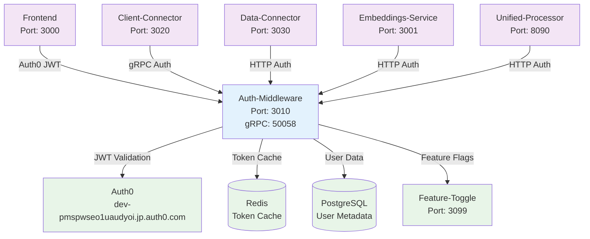

# ConFuse Auth Middleware

> **Auth0-based Authentication Service for the ConFuse Platform**

## What is this service?

The **auth-middleware** is ConFuse's centralized authentication and authorization layer. It provides **Auth0-based JWT validation** and **gRPC authentication services** for all microservices in the platform.

## Quick Start

```bash
# Clone and install
git clone https://github.com/confuse/auth-middleware.git
cd auth-middleware
npm install

# Configure environment
cp .env.map.example .env.map
cp .env.secret.example .env.secret

# Setup database
npm run prisma:push

# Start development server
npm run dev
```

The service starts at:
- **HTTP**: `http://localhost:3010`
- **gRPC**: `localhost:50058`

## Documentation

| Document | Description |
|----------|-------------|
| [Architecture](architecture.md) | Service design and Auth0 flows |
| [API Reference](api-reference.md) | Complete REST/gRPC endpoints |
| [Configuration](configuration.md) | Environment variables |
| [Integration](integration.md) | How services use this auth layer |

## How It Fits in ConFuse



## Key Features

### 1. **Auth0 JWT Validation**
- **Primary Authentication**: Validates Auth0-issued JWT tokens
- **Token Caching**: Redis-based token validation cache (TTL: 15 minutes)
- **gRPC Support**: Provides gRPC authentication service for other microservices
- **Zero-Trust**: Security headers and CORS enforcement

### 2. **Service-to-Service Authentication**
- **gRPC Server**: Port 50058 for internal service authentication
- **HTTP Endpoints**: REST API for token validation and user info
- **Rate Limiting**: Redis-backed rate limiting for all endpoints
- **Audit Logging**: Winston-based structured logging

### 3. **Security Features**
- **Helmet.js**: Security headers and XSS protection
- **CORS**: Configurable origins for frontend integration
- **Rate Limiting**: Request throttling and abuse prevention
- **Structured Logging**: Correlation IDs and trace tracking

### 4. **Configuration Management**
- **Environment Split**: `.env.map` (non-sensitive) + `.env.secret` (sensitive)
- **Feature Toggle Integration**: Dynamic feature flag support
- **Multi-Environment**: Development, staging, production configs

## Technology Stack

| Technology | Purpose | Version |
|------------|---------|---------|
| **Node.js** | Runtime | >=24.0.0 |
| **TypeScript** | Type Safety | 5.3.3 |
| **Express.js** | Web Framework | 4.18.2 |
| **Auth0** | Identity Provider | Custom Domain |
| **gRPC** | Service Communication | 1.14.3 |
| **Prisma** | Database ORM | 5.7.1 |
| **PostgreSQL** | User Metadata | - |
| **Redis** | Token Cache & Rate Limiting | 5.10.0 |
| **Winston** | Structured Logging | 3.11.0 |

## Service Endpoints

### REST API (Port 3010)
```
GET  /health                    - Health check
GET  /auth/validate            - JWT validation
POST /auth/refresh             - Token refresh
GET  /auth/userinfo            - User information
```

### gRPC Service (Port 50058)
```
rpc ValidateToken(ValidateTokenRequest) returns (ValidateTokenResponse)
rpc GetUserInfo(GetUserInfoRequest) returns (GetUserInfoResponse)
rpc RefreshToken(RefreshTokenRequest) returns (RefreshTokenResponse)
```

## Environment Configuration

### Required Environment Variables

#### `.env.map` (Non-sensitive)
```bash
PORT=3010
GRPC_PORT=50058
NODE_ENV=production
TOKEN_CACHE_TTL_SECONDS=900
AUTH0_DOMAIN=dev-pmspwseo1uaudyoi.jp.auth0.com
AUTH0_ISSUER=https://dev-pmspwseo1uaudyoi.jp.auth0.com/
AUTH0_AUDIENCE=https://api.confuse.dev
AUTH0_JWKS_URI=https://dev-pmspwseo1uaudyoi.jp.auth0.com/.well-known/jwks.json
FEATURE_TOGGLE_SERVICE_URL=http://localhost:3099
CORS_ORIGINS=http://localhost:3000,https://confuse.platform.example.com
FRONTEND_URL=http://localhost:3000
```

#### `.env.secret` (Sensitive)
```bash
POSTGRES_CONNECTION_STRING=postgresql://...
REDIS_URL=redis://...
AUTH0_CLIENT_SECRET=...
AUTH0_MANAGEMENT_API_TOKEN=...
```

## Service Dependencies

| Service | Dependency Type | Purpose |
|---------|-----------------|---------|
| **Auth0** | External | Identity provider & JWT issuance |
| **PostgreSQL** | Database | User metadata and session data |
| **Redis** | Cache | Token validation cache & rate limiting |
| **Feature-Toggle** | Internal | Dynamic feature flag support |

## Client Services Integration

All ConFuse microservices integrate with auth-middleware:

| Service | Integration Method | Use Case |
|---------|-------------------|----------|
| **Frontend** | Auth0 SDK + HTTP JWT validation | User authentication |
| **Client-Connector** | gRPC client | MCP connection validation |
| **Data-Connector** | HTTP middleware | API request authentication |
| **Embeddings-Service** | HTTP middleware | Request authorization |
| **Unified-Processor** | HTTP middleware | Processing request validation |

## Security Model

### Authentication Flow
1. **Frontend**: Authenticates via Auth0 → receives JWT
2. **Service Calls**: Include JWT in Authorization header
3. **Auth-Middleware**: Validates JWT signature + claims
4. **Cache**: Valid tokens cached in Redis for 15 minutes
5. **Response**: Authentication decision returned to service

### Service-to-Service Flow
1. **Internal Service**: Calls gRPC endpoint with token
2. **Auth-Middleware**: gRPC validation service
3. **Response**: User context and permissions

## Monitoring & Observability

### Logging
- **Structured JSON logs** via Winston
- **Correlation IDs** for request tracing
- **Security events** audit logging

### Metrics
- **Token validation** success/failure rates
- **Rate limiting** statistics
- **gRPC request** latency and error rates

## Development

### Local Development Setup
```bash
# Install dependencies
npm install

# Setup environment
cp .env.map.example .env.map
cp .env.secret.example .env.secret
# Edit both files with your values

# Database setup
npm run prisma:push

# Start development
npm run dev
```

### Testing
```bash
# Run unit tests
npm test

# Run gRPC integration tests
npm run test:grpc

# Lint code
npm run lint
```

## Troubleshooting

### Common Issues

#### "Invalid JWT signature"
- Check `AUTH0_DOMAIN` and `AUTH0_ISSUER` configuration
- Verify `AUTH0_AUDIENCE` matches your API identifier
- Ensure JWT token is not expired

#### "Redis connection failed"
- Verify Redis is running on configured port
- Check `REDIS_URL` in `.env.secret`
- Ensure Redis credentials are correct

#### "gRPC server not starting"
- Check `GRPC_PORT` is not in use
- Verify gRPC proto files are generated
- Check network permissions

## License

Proprietary - ConFuse Team
